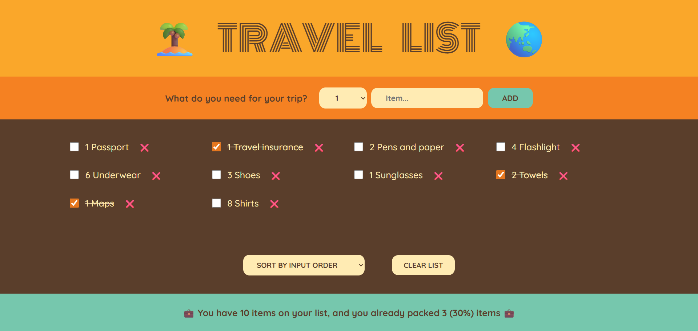

# 🏝️ Travel List App

A simple React app to manage your travel packing list.

### 🌐 Live Demo

👉 [Try the live Application!](https://nkieu-travel-list.vercel.app/)

---

## 📸 Screenshots



---

## 🚀 Features

- ✅ Add Items: Add new items with quantity and description to your packing list.
- 📝 Dynamic Form Handling: Controlled inputs for both text and select dropdown.
- 📦 Mark as Packed: Toggle the packed status of each item using a checkbox.
- 🗑️ Delete Items: Remove individual items from the list.
- 📊 Item Sorting: Sort items by input order, description (A-Z), or packed status.
- ♻️ Clear All: Delete all items from the list after user confirmation.
- 📈 Packing Statistics: Track total items, packed items, and completion percentage.

---

## 🧠 Learning Goals

This project is built to understand and practice key React concepts:

- **React Components** and file structuring
- **useState** for state management
- **Lifting State Up** for shared state between components
- **Derived State** for computed values like stats
- **Controlled Components** (`input`, `select`)
- **Props** for parent-to-child and child-to-parent communication
- Basic **conditional rendering**
- Working with **arrays**: `map()`, `filter()`, and `sort()`

---

## 🛠️ Technology Stack

- React (v18+)
- JavaScript (ES6+)

---

## 🚀 Installation & Setup

1. **Clone the repository**

   ```bash
   git clone https://github.com/nkieu-config/travel-list-app-project.git
   ```

2. **Install dependencies**

   ```bash
   npm install
   ```

3. **Start development server**

   ```bash
   npm run dev
   ```

⚠️ Requires Node.js and npm installed.

---

## 📚 Course Credit

This project was developed as part of **[The Ultimate React Course 2025](https://www.udemy.com/course/the-ultimate-react-course/)** by [Jonas Schmedtmann](https://codingheroes.io/)

---

## 📃 License

This is a personal learning project and not intended for production use.
